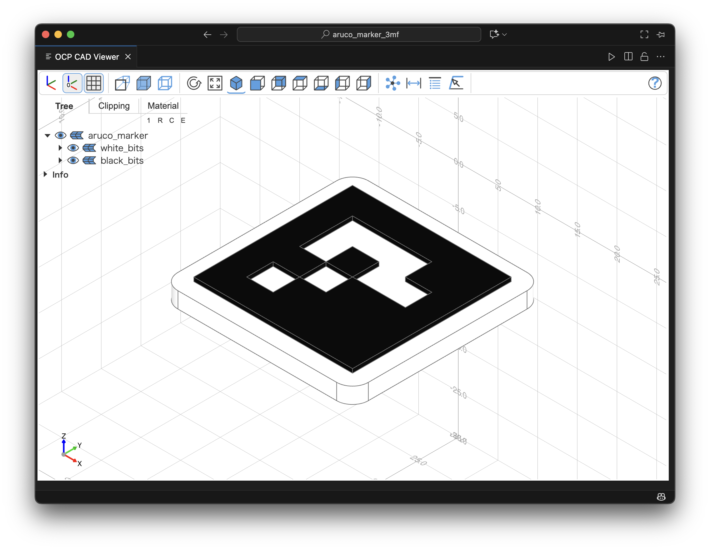
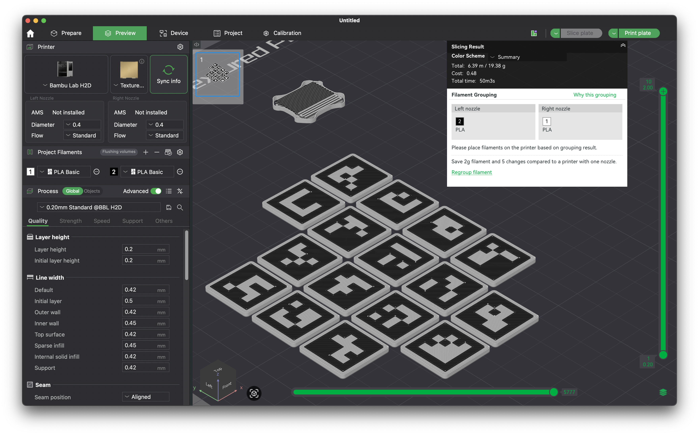

# ArUcoマーカー 3Dモデルジェネレーター

このプロジェクトは、3Dプリント可能なArUcoマーカーの3Dモデルを生成するPythonスクリプトです。[OpenCV](https://github.com/opencv/opencv-python)で**ArUcoマーカー**の画像を生成し、[CadQuery](https://github.com/CadQuery/cadquery)を使用してパラメトリックに3Dモデルを生成します。黒と白のパーツが別々のパーツとして作成されるため、**マルチカラー3Dプリンター**での印刷が容易です。

## 必要条件 / Requirements

-   Python 3.12.10 (動作確認済)
-   [requirements.txt](requirements.txt) に記載されたPythonパッケージ

## 使用方法 / Usage

[`script/main.py`](script/main.py) を実行すると、[`output`](output) ディレクトリにSTLファイルが生成されます。

スクリプト内のパラメータを変更することで、生成するマーカーをカスタマイズできます。[`script/main.py`](script/main.py) 内の `ArucoMarkerGenerator` クラスを初期化する際に、以下の値を変更します。

-   `aruco_dict_id`: 使用するArUco辞書のID (例: `cv2.aruco.DICT_4X4_50`)
-   `marker_id`: マーカーのID
-   `side_length`: マーカーの辺の長さ (mm)
-   `thickness`: マーカー全体の厚み (mm)
-   `margin`: マーカー周囲の余白 (mm)
-   `black_bits_thickness`: 黒い部分の厚み (mm)
-   `white_bits_thickness`: 白い部分の厚み (mm)

## プレビュー / Preview

OCP CAD Viewerでのモデルプレビュー:

## マルチカラー3Dプリント / Multi-color 3D Printing

Bambu Studioでのスライス結果:

Bambu Studioでマルチカラー印刷を行う手順の例です。

1.  生成されたSTLファイルをインポートします。
2.  **Color Painting** ツールを使用し、**Tool type** を **Height Range** に設定して、マーカーの上面（黒い部分）をペイントします。
3.  オブジェクトを右クリックし、**Split** > **To objects** を実行します。
4.  **Arrange all objects** を実行して、すべてのオブジェクトをプレート上に配置します。
5.  **Slice plate** を実行してスライスします。

**注意点:**
`black_bits_thickness` と `white_bits_thickness` の設定によっては、黒い部分と白い部分の上面が同じ高さになる場合があります。その場合、**Height Range** でのペイントが機能しないため、各マーカーをパーツに分割し、手動でフィラメントの設定をする必要があります。

